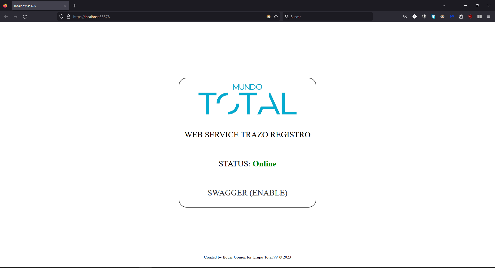
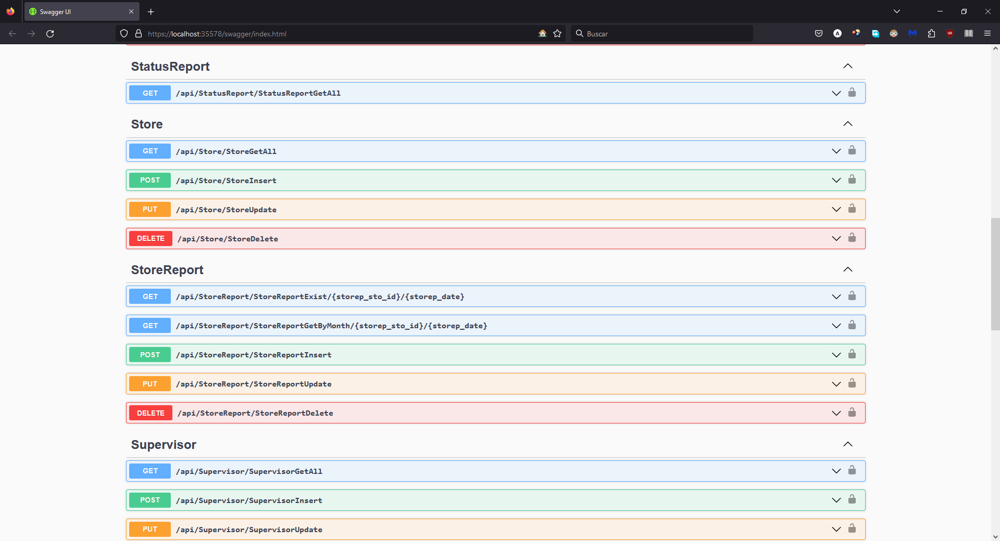

# WEB REST API Trace Register

This is a WEB REST API to manage the sales and money flow of a group of stores.

Using:

- Https Endpoints
- JWT Tokens
- Dapper and Store Procedures for efficiency
- Swagger for DEBUG
- HTML front page

[ADMIN APP]()

[STORE APP]()

---

## Main

## Token

## Requests

